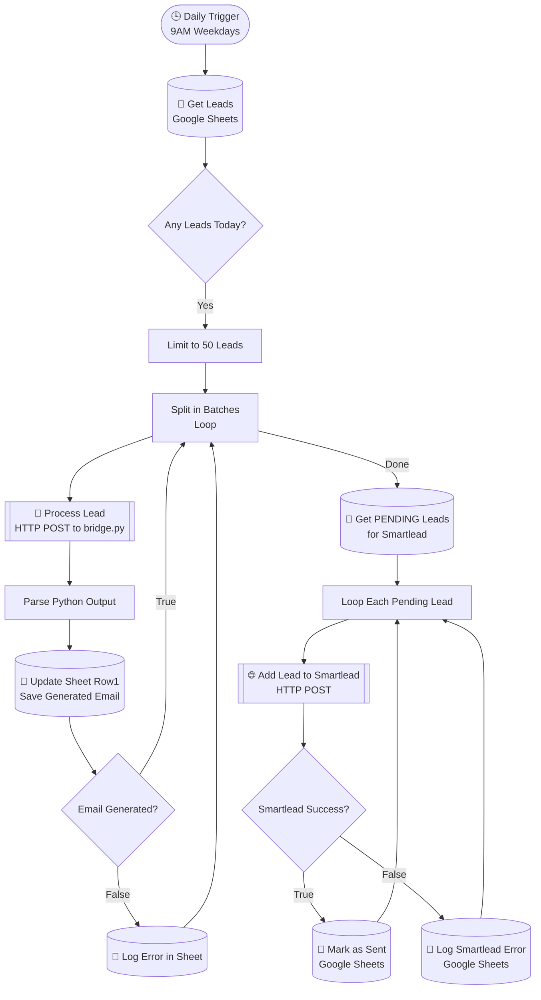

# AI-Leads n8n Generation pipeline 🚀

A fully autonomous, self-learning lead generation and personalized email outreach pipeline designed specifically for the funeral service niche. The system integrates **n8n** (hosted locally), a **Python automation bridge**, **Google Sheets**, **Google Gemini AI**, and **Smartlead.ai**.

## 📌 Architecture Overview

This project uses a hybrid architecture to bypass n8n's local execution limitations:
1. **n8n Workflow Engine**: Orchestrates the data flow, scheduling, and API integrations (Google Sheets & Smartlead).
2. **Python Bridge (`bridge.py`)**: A local HTTP server (running on port 5680) that accepts POST requests from n8n.
3. **Core Script (`tekscrum_pipeline.py`)**: Executed by the bridge, it performs heavy lifting: web scraping, mobile PageSpeed checks, Google My Business lookups, and AI email generation using Gemini.

---

## 🗺️ n8n Workflow Graph

Below is the visual representation of how the nodes connect in the n8n canvas:



---

## 🛠️ Key Components & Setup Instructions

### 1. Google Sheets Connection (Service Account)
To connect Google Sheets to local n8n without OAuth redirect issues:
- We use a **Google Service Account** (`.json` key file).
- The JSON file is stored locally (e.g., `xenon-lyceum-*.json`) and uploaded to n8n credentials.
- **Important**: The Service Account email (e.g., `n8n-bot@...`) must be added as an **Editor** to the target Google Sheet.

### 2. Gemini API Quota Management
The pipeline does heavy processing using Google Gemini. To prevent `429 RESOURCE_EXHAUSTED` crashes:
- `tekscrum_pipeline.py` implements a robust **API Key Rotation** system.
- It dynamically rotates through 8 different API keys stored in the `.env` file. If one key hits its rate limit, it seamlessly falls back to the next key.

### 3. Smartlead.ai Integration
Leads are pushed automatically to a Smartlead campaign.
- **Endpoint Used**: `https://server.smartlead.ai/api/v1/campaigns/{campaign_id}/leads`
- **Method**: `POST`
- *(Note: Ensure you use `server.smartlead.ai/api/...` and NOT the dashboard URL `app.smartlead.ai`)*

---

## 🐛 Common Errors & Solutions (Troubleshooting Guide)

Throughout the development of this pipeline, we encountered and resolved several critical errors. Here is how to fix them if they reappear:

| Error / Symptom | Root Cause | Solution |
| :--- | :--- | :--- |
| **`429 RESOURCE_EXHAUSTED`** (Gemini) | Free tier API limits exceeded. | Ensure `.env` has multiple `GEMINI_API_KEY_1` to `8` filled. The script will rotate them automatically. |
| **`Response body is not valid JSON`** (Smartlead Node) | n8n was hitting the Smartlead Dashboard URL instead of the API. | Change node URL to `https://server.smartlead.ai/api/...` instead of `https://app.smartlead.ai/...` |
| **`400 Bad Request`** (Smartlead) | Sending unsupported parameters in the JSON body. | Removed `"settings.reuse_lead_from_campaign"` from the n8n HTTP Request JSON body. |
| **`#ERROR!` in Google Sheets** | n8n sent the literal string `={{ $json['Subject'] }}`. | In n8n, click the gear icon next to the field and switch it from **"Fixed"** to **"Expression"**. |
| **`The 'Column to Match On' parameter is required`** | The node configuration was accidentally wiped. | Open the Google Sheets node, set *Column to Match On* back to `Email`. |
| **Python Regex Error (`global flags not at start`)** | `(?i)` flag was placed incorrectly inside the `re.sub` pattern. | Changed `^(?i)` to `(?i)^` inside `tekscrum_pipeline.py` line 766. |

---

## 🚀 How to Run the Project

1. **Start the Python Bridge**:
   Open a terminal in this directory and run:
   ```bash
   python bridge.py
   ```
   *Leave this terminal open. It listens on port 5680.*

2. **Start n8n**:
   Open another terminal and run:
   ```bash
   n8n
   ```
   *Access the interface at `http://localhost:5678`.*

3. **Execute**:
   Open the `AI-Leads-n8n-Genration` workflow in n8n and click **"Execute Workflow"**. Watch the leads get processed automatically!
